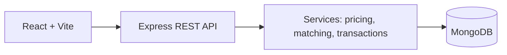

# AgriLink

AgriLink is an SIH-ready agricultural marketplace that gives farmers transparent mandi prices and connects verified supply with buyer demand.

**Canonical codebase:** this `do/` directory. See [MIGRATION.md](MIGRATION.md)
for the consolidation note and local run instructions.

## What works

- JWT + bcrypt authentication and role-protected Farmer, Buyer, FPO and Admin dashboards
- Farmer lots with quality, buyer demands, explainable matching, offers and safe offer acceptance
- A transaction lifecycle with logistics and payment status updates
- Mandi comparison, 30-day trend statistics and rule-based (not predictive) selling insight
- MongoDB seed data and responsive React UI backed only by REST APIs

## Architecture

## Run locally

1. Install MongoDB locally or set `MONGO_URI` to MongoDB Atlas.
2. Copy `backend/.env.example` to `backend/.env` and `frontend/.env.example` to `frontend/.env`.
3. From this root run `npm install`, then `npm --prefix backend install` and `npm --prefix frontend install`.
4. Run `npm run seed`, then `npm run dev`.
5. Open `http://localhost:5173`.

Demo password for every seeded account: `Demo@12345`

| Role | Email |
|---|---|
| Admin | admin@agrilink.com |
| Farmer | farmer@agrilink.com |
| FPO | fpo@agrilink.com |
| Buyer | buyer@agrilink.com |

## Main API endpoints

| Method | Endpoint | Purpose |
|---|---|---|
| POST | `/api/auth/register`, `/login` | Auth |
| GET/POST | `/api/lots` | Browse / create lots |
| GET | `/api/prices`, `/api/prices/trends`, `/api/markets` | Market intelligence |
| GET/POST | `/api/demands` | Buyer demand |
| GET | `/api/matches/:demandId` | Explainable recommendations |
| GET/POST | `/api/offers` | Offers |
| PATCH | `/api/offers/:id/accept` | Reserve stock and create transaction |
| GET/PATCH | `/api/transactions`, `/api/payments/:transactionId` | Lifecycle and payment |

All responses use `{ success, message, data }`. Protected endpoints require `Authorization: Bearer <token>`.

## Matching and price intelligence

Matching is transparent: commodity 25%, quantity 20%, quality 20%, location 15%, price 15%, deadline 5%. Price intelligence calculates current, 7/30 day averages, min/max, percentage change and an UP/DOWN/STABLE trend. Selling insights are rule-based market guidance, not financial advice or a guaranteed prediction.

## Future extensions

Additional provider, warehouse, dispute and notification collections are available through the same modular service pattern. Map, live mandi feed, payments and ML forecasts are intentionally external/future integrations.
